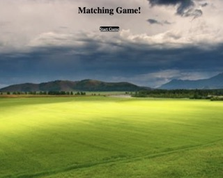
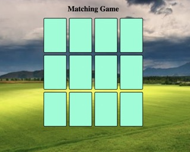
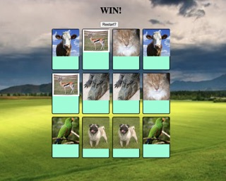

# Matching-game

## Date: 10/7/2022

### By: Carlos Hidalgo

#### [GitHub](https://github.com/pancholo35) | [LinkedIn](https://www.linkedin.com/in/carlos-hidalgo-a2a320211/)

---

### **_Description_**

#### It's matching game where you match pictures!

---

### **_Technolodgies Used_**

- VisualStudio Code

---

### **_Getting Started_**

#### The project itself was deployed and can be viewed [here](fieldoffriends.surge.sh)

---

### **_Screenshots_**

#### Start screen:

#### Start of game:

#### Win message:

### **_Future Updates_**

- [ ] Improve styling
- [ ] Win counter
- [ ] Different selectable themes
- [ ] Card animations
- [ ] Game sound effects

### **_Credits_**

- Line 131 credit https://www.linkedin.com/pulse/nodejs-16-settimeout-asyncawait-igor-gonchar/

#### To whomever gets credited: Thank You!
